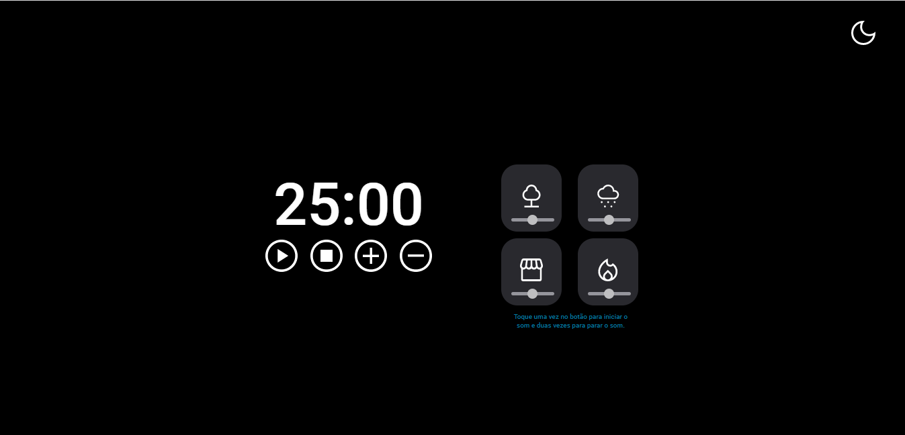
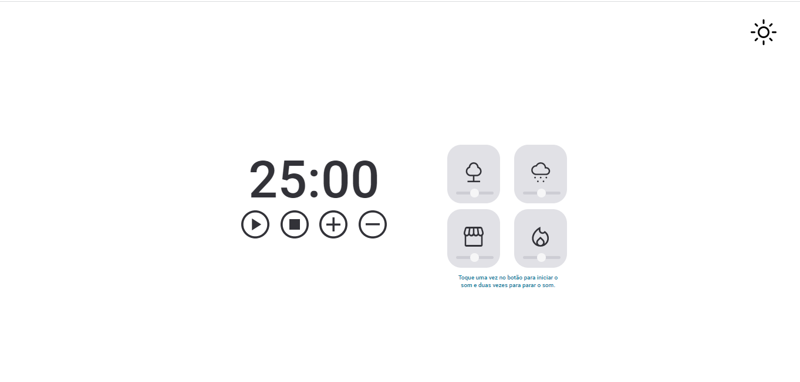

<h1 align="center"> FocusTimer - Dark Mode </h1>

  <a href="#-tecnologias">Tecnologias</a>&nbsp;&nbsp;&nbsp;|&nbsp;&nbsp;&nbsp;
  <a href="#-projeto">Projeto</a>&nbsp;&nbsp;&nbsp;|&nbsp;&nbsp;&nbsp;
  <a href="#-layout">Layout</a>&nbsp;&nbsp;&nbsp;|&nbsp;&nbsp;&nbsp;
  <a href="#memo-licença">Licença</a>

  

Esse projeto é um cronometro onde você pode colocar uma musiquinha de fundo e controlar o volume enquanto o tempo passa. Além de poder adicionar o tempo que preferir.

Caso queira colocar minutos diferentes do já programado, basta clicar duas vezes no botão de Pause.

Ao clicar nos botões a música inicia, para parar, basta clicar duas vezes no botão.

É possível trocar o para o mmodo claro clicando no botão superior direito, "na lua" ou no "sol".

Funcionalidades esperadas dos botões:

- Play   : aciona o timer;
- Stop   : para o timer;
- "+"   : aumenta em mais 5 minutos o tempo do timer;
- "-"    : diminui em 5 minutos o tempo do timer.

 

## 🚀 Tecnologias

Esse projeto foi desenvolvido com as seguintes tecnologias:

&nbsp;
&nbsp;
&nbsp;

## 💻 Projeto

- ES Modules
- Conceitos de Clean Code
- Funções callbacks
- Recursividade
- Injeção de dependências
- Manipulação da DOM
- Web APIs
- Manipulação de vetores
- Refatoração

## 🔖 Layout

## Venha ver como ficou e teste as funcionalidades:

https://daiaanebarbosaf.github.io/FocusTimeDarkMode/

---
